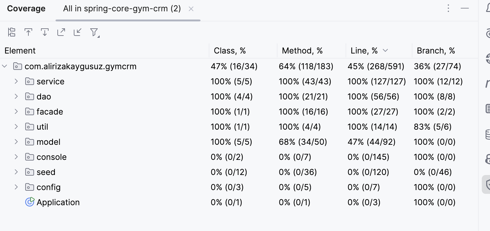

JAVA SPRING CORE TASK
=============================

### Main task: 1

**Task:** Implement three service classes: Trainee Service, Trainer Service, Training Service.

**Implementation:**

-   `service/TraineeService.java`

-   `service/TrainerService.java`

-   `service/TrainingService.java`

* * * * *

### Main task: 2

**Task:** Trainee Service class should support possibility to create / update / delete / select Trainee profile.

**Implementation:**\
`TraineeService` supports:

-   create

-   update

-   delete

-   select (by id, by username)

-   getAll

**Note:**\
`getAll` is used in the console test to display all trainee records.

* * * * *

### Main task: 3

**Task:** Trainer Service class should support possibility to create / update / select Trainer profile.

**Implementation:**\
`TrainerService` supports:

-   create

-   update

-   select (by id, by username)

-   getAll

**Note:**\
`getAll` is used in the console test to display all trainer records.

* * * * *

### Main task: 4

**Task:** Training Service class should support possibility to create / select Training profile.

**Implementation:**\
`TrainingService` supports:

-   create

-   select (by id only)

-   getAll

**Note:**\
`getAll` is used in the console test to display all training records.

* * * * *

Notes
-----

* * * * *

### Notes: 1 --- Spring application context configuration

**Task:** Configure spring application context based on the Spring annotation or on Java based approach.

**Implementation:**

-   Annotation-based configuration is used

-   `@Configuration`, `@ComponentScan`, `@Component` annotations

-   No XML configuration

-   Application context initialized manually using `AnnotationConfigApplicationContext`

Files:

-   `config/AppConfig.java`

-   `Application.java`

* * * * *

### Notes: 2 --- DAO objects and common in-memory storage

**Task:** Implement DAO objects for Trainer, Trainee, Training. They should store in and retrieve data from a common in-memory storage -- java map. Each entity should be stored under a separate namespace, so you could list particular entity types.

**Implementation:**

-   DAO classes:

    -   `dao/TraineeDao.java`

    -   `dao/TrainerDao.java`

    -   `dao/TrainingDao.java`

-   Storage type: `Map<Long, Entity>`

**Separate namespaces:**\
Separate namespaces are implemented using `@Qualifier`-based injection with explicit bean names:

-   `traineeStorage`

-   `trainerStorage`

-   `trainingStorage`

Storage definition file:

-   `config/InMemoryStorageConfig.java`

* * * * *

### Notes: 3 --- Storage bean + initialization from file (bean post-processing)

**Task:** Storage should be implemented as a separate spring bean. Implement the ability to initialize storage with some prepared data from the file during the application start (use spring bean post-processing features). Path to the concrete file should be set using property placeholder and external property file. In other words, every storage (java.util.Map) should be implemented as a separate spring bean.

**Implementation:**

-   Each in-memory storage is defined as a separate Spring bean in:

    -   `config/InMemoryStorageConfig.java`

-   Startup initialization is implemented using `BeanPostProcessor` in:

    -   `seed/SeedInitializer.java`

-   Seed file paths are configured via property placeholders in:

    -   `application.properties`

**Reading prepared data from JSON:**

-   JSON reading is implemented in:

    -   `seed/JsonSeedReader.java`

-   Seed DTO classes used for deserialization:

    -   `seed/dto/TraineeSeedDto.java`

    -   `seed/dto/TrainerSeedDto.java`

    -   `seed/dto/TrainingSeedDto.java`

**Mapping DTO → Entity before inserting into storages:**

-   Mapper classes used:

    -   `seed/mapper/TraineeSeedMapper.java`

    -   `seed/mapper/TrainerSeedMapper.java`

    -   `seed/mapper/TrainingSeedMapper.java`

    -   `seed/mapper/UserSeedMapperApplier.java`

    -   `seed/mapper/SeedBaseMapper.java`

**Note (implementation detail):**\
During initialization, storage access is handled using `ObjectProvider` to avoid bean initialization order issues, and storages are populated after they are available.

* * * * *

### Notes: 4 --- Dependency injection rules

**Task:** DAO with storage bean should be inserted into services beans using auto wiring. Services beans should be injected into the facade using constructor-based injections. The rest of the injections should be done in a setter-based way.

**Implementation:**

**DAO → Service (constructor injection):**

-   Services receive DAOs using constructor injection:

    -   `TraineeService(TraineeDao ...)`

    -   `TrainerService(TrainerDao ...)`

    -   `TrainingService(TrainingDao ...)`

**UserValidator + CredentialsGenerator → Service (setter injection):**

-   Services receive supporting dependencies using setter injection:

    -   `setUserValidator(UserValidator ...)`

    -   `setCredentialsGenerator(CredentialsGenerator ...)`

**Services → Facade (constructor injection):**

-   `GymCrmFacade` receives services via constructor injection:

    -   `GymCrmFacade(TraineeService, TrainerService, TrainingService)`

**Facade → ConsoleRunner (setter injection):**

-   `ConsoleRunner` receives `GymCrmFacade` via a setter method.

* * * * *

### Notes: 5 --- Unit tests

**Task:** Cover code with unit tests.

**Implementation:**

-   Unit tests are implemented for:

    -   DAO layer

    -   Service layer

    -   Facade layer

    -   Validator classes

    -   Utility classes

**Coverage (by layer):**

-   `dao`: 100%

-   `service`: 100%

-   `facade`: 100%

-   `util`: 83%

-   `validator`: 100%



* * * * *

### Notes: 6 --- Logging

**Task:** Code should contain proper logging.

**Implementation:**

-   Logging implemented in:

    -   Service layer:

        -   create

        -   update

        -   select

        -   getAll

        -   delete

    -   Facade layer:

        -   `createTrainingProfile`

    -   Seed initialization lifecycle

* * * * *

### Notes: 7 --- Username and password calculation

**Task:** For Trainee and Trainer create profile functionality implement username and password calculation by follow rules.

**Implementation:**

-   Credentials logic is centralized in:

    -   `util/CredentialsGenerator.java`

-   Username format: `FirstName.LastName`

-   Duplicate usernames resolved by numeric suffix

-   Password generated as random 10-character string

Used in:

-   `TraineeService`

-   `TrainerService`

-   `seed/mapper/UserSeedMapperApplier.java`

* * * * *

Package Structure (Simplified)
------------------------------

```
com.alirizakaygusuz.gymcrm
├── Application.java
├── config
│   ├── AppConfig.java
│   ├── InMemoryStorageConfig.java
│   └── JacksonConfig.java
├── console
│   └── ConsoleRunner.java
├── dao
│   ├── TraineeDao.java
│   ├── TrainerDao.java
│   ├── TrainingDao.java
│   └── util
│       └── IdSequence.java
├── facade
│   └── GymCrmFacade.java
├── model
│   ├── User.java
│   ├── Trainee.java
│   ├── Trainer.java
│   ├── Training.java
│   └── TrainingType.java
├── seed
│   ├── SeedInitializer.java
│   ├── JsonSeedReader.java
│   ├── dto
│   │   ├── TraineeSeedDto.java
│   │   ├── TrainerSeedDto.java
│   │   └── TrainingSeedDto.java
│   └── mapper
│       ├── SeedBaseMapper.java
│       ├── TraineeSeedMapper.java
│       ├── TrainerSeedMapper.java
│       ├── TrainingSeedMapper.java
│       └── UserSeedMapperApplier.java
├── service
│   ├── TraineeService.java
│   ├── TrainerService.java
│   ├── TrainingService.java
│   └── validator
│       ├── CommonValidator.java
│       └── UserValidator.java
└── util
    └── CredentialsGenerator.java
```

Dependencies
------------

### Java & Build

-   **Java:** 17 (LTS)

-   **Build Tool:** Maven

### Core Framework

-   **Spring Framework:** 6.2.7

### JSON Processing

-   **Jackson**

### Testing

-   **JUnit 5 (Jupiter)**

-   **Mockito**

-   **AssertJ**

* * * * *