# **GymCRM - Spring Boot REST API**

A production-ready gym customer relationship management system built with Spring Boot, featuring JWT authentication, Redis-based rate limiting and token blacklist, comprehensive monitoring, and multi-environment support.

---

## **Key Features**

### **Authentication & Authorization**
- **JWT-based authentication** with Bearer token
- **Redis-backed token blacklist** for logout functionality
- **Login rate limiting** (3 failed attempts → 5-minute lockout)
- Login endpoint returns JWT token with expiration time
- Protected endpoints require `Authorization: Bearer <token>` header
- **Role-based authorization** (TRAINER, TRAINEE roles)
- **Self-service access control** via Spring Security `@PreAuthorize`
  - Users can only access their own resources (username match enforcement)
  - Composed security annotations: `@SelfTraineeService`, `@SelfTrainerService`
- **BCrypt password encryption**
- **Public endpoints:** trainee/trainer registration, login, training types

### **Security Features**
- **Login Rate Limiting**
  - Brute force protection via `LoginRateLimitInterceptor`
  - Redis-based attempt tracking: 3 failed attempts → 5-minute block
  - Externalized config: `security.rate-limit.login` (max-attempts, block-duration)

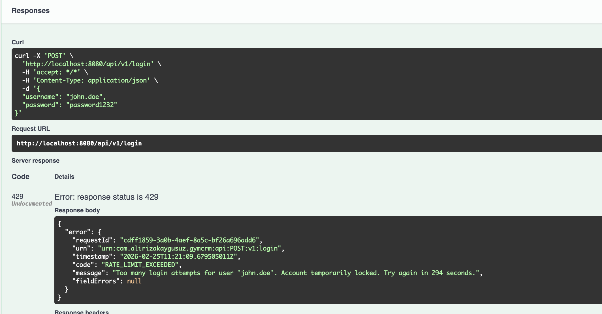

- **JWT Token Blacklist**
  - Logout invalidates tokens via Redis blacklist
  - `LogoutInterceptor` automatically extracts and blacklists tokens
  - Blacklist TTL matches token's remaining expiration time
  - Externalized config: `security.token-blacklist` (enabled, redis-key-prefix)

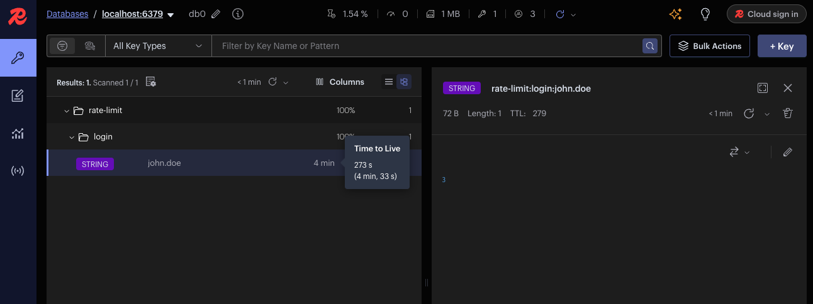

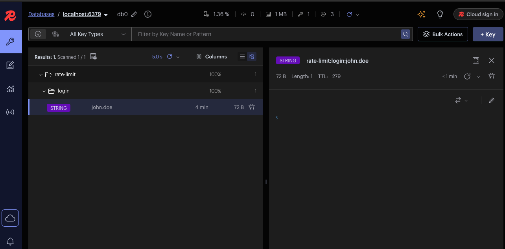

### **Monitoring & Observability**
- **Spring Boot Actuator** endpoints for health checks and metrics
- **Custom health indicators:**
  - Database connectivity (PostgreSQL)
  - JWT Service configuration
  - Training types seed data validation (expects 11 types)
- **Custom Prometheus metrics:**
  - Login attempts, successes, and failures
  - User registration attempts and successes (trainee/trainer)
- **Multi-environment profile support** (local, dev, docker, stg, prod)

### **API Endpoints**
- **Authentication:** Login (POST), Logout (POST), change password (PATCH)
- **Trainee Management:** Register, get profile, update, delete, activate/deactivate
- **Trainer Management:** Register, get profile, update, activate/deactivate
- **Training Management:** Add training (trainer only), get training types
- **Relationships:** Assign/update trainee's trainers, get unassigned trainers

### **Important Business Rules**
- **Only trainers can create trainings** - Trainees cannot add training sessions
- Training creation requires trainer authentication (JWT token must belong to a trainer)
- Self-service enforcement: john.doe can only access `/api/v1/trainees/john.doe`, not other profiles

---

## **Architecture & Design**

### **Self-Service Authorization System**

**Implementation:**
- Spring Security `@PreAuthorize` with custom composed annotations
- `@SelfTraineeService`: TRAINEE role + username validation
- `@SelfTrainerService`: TRAINER role + username validation
- `AccessPolicy` bean provides reusable `isSelf()` authorization logic
- JWT tokens include role claims for stateless authentication

**Flow:**
1. User authenticates → JWT filter sets Authentication with roles
2. Request: `GET /api/v1/trainees/john.doe`
3. `@SelfTraineeService` checks: `hasRole('TRAINEE') and @accessPolicy.isSelf(authentication, #username)`
4. Match → Allow (200 OK) | Mismatch → 403 Forbidden

### **Rate Limiting & Token Blacklist Architecture**

**Login Rate Limiting:**
- `LoginRateLimitInterceptor` intercepts `/api/v1/login` requests
- Redis key: `rate-limit:login:{username}` with TTL
- Blocks user after 3 failed attempts for 5 minutes

**Token Blacklist:**
- `LogoutInterceptor` intercepts `/api/v1/logout` requests
- Extracts token from `Authorization` header automatically
- Redis key: `token:blacklist:{jwt_token}` with TTL = remaining token expiration
- `JwtAuthenticationFilter` checks blacklist before authentication

### **Environment Profiles**

| Profile | Description | Database |
|---------|-------------|----------|
| **local** | Developer machine | localhost:5432 |
| **dev** | Shared development server | dev-db:5432 |
| **docker** | Docker Compose local test | postgres:5432 |
| **stg** | Staging (pre-production) | stg-db.example.com |
| **prod** | Production | prod-db.example.com |

### **Error Handling**
- Enhanced `ApiErrorResponse` with URN, request ID, timestamp
- Request ID extracted via `RequestContextHolder`
- Distinct exception types:
  - `AuthenticationFailedException` - Invalid credentials (401)
  - `AuthorizationFailedException` - Forbidden access (403)
  - `RateLimitExceededException` - Too many requests (429)
  - `ResourceNotFoundException` - Entity not found (404)
  - `ValidationException` - Invalid input (400)

### **Code Quality**
- Service layer fully covered with unit tests (88% coverage)
- Swagger schemas aligned with seed data for easier manual testing

---

## **Running the Application**

### **Build & Start**

#### **Step 1: Build**
```bash
mvn clean package -DskipTests
```

#### **Step 2: Start Containers and Check logs**
```bash
docker compose up --build
```

Wait for: `Started Application in X seconds`

#### **Step 4: Access Services**
- **Swagger UI:** http://localhost:8080/swagger-ui/index.html
- **Actuator Health:** http://localhost:8080/actuator/health
- **Actuator Health Readiness:** http://localhost:8080/actuator/health/readiness
- **Actuator Health Liveness:** http://localhost:8080/actuator/health/liveness
- **Actuator Info:** http://localhost:8080/actuator/info
- **Prometheus Metrics:** http://localhost:8080/actuator/prometheus

---

## **Monitoring & Observability**

### **Actuator Endpoints**

#### **1. Health Check**
**Endpoints:**
- http://localhost:8080/actuator/health
- http://localhost:8080/actuator/health/readiness
- http://localhost:8080/actuator/health/liveness

**Custom Health Indicators:**
- **Database:** PostgreSQL connection status
- **JWT Service:** Token generation/validation health
- **Training Types:** Validates 11 training types are present

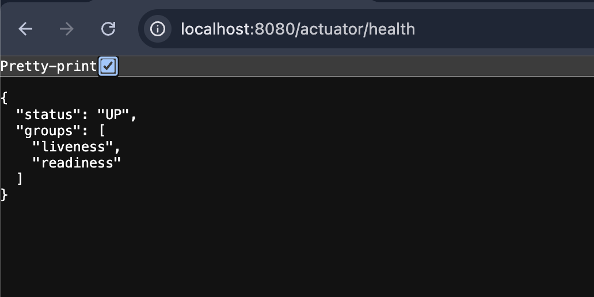
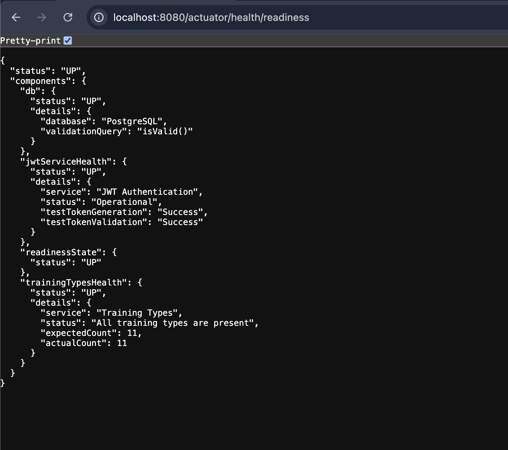
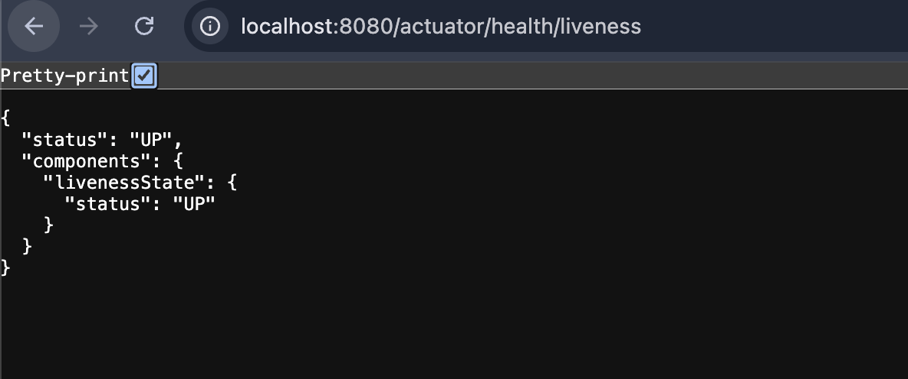

---

#### **2. Application Info**
**Endpoint:** http://localhost:8080/actuator/info

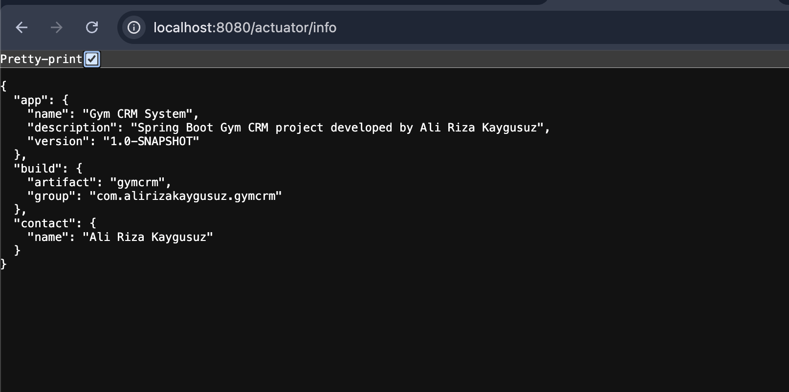

**Response:**
```json
{
  "app": {
    "name": "Gym CRM System",
    "description": "Spring Boot Gym CRM project developed by Ali Rıza Kaygusuz",
    "version": "1.0-SNAPSHOT"
  },
  "build": {
    "artifact": "gymcrm",
    "group": "com.alirizakaygusuz.gymcrm"
  },
  "contact": {
    "name": "Ali Rıza Kaygusuz"
  }
}
```

---

#### **3. Prometheus Metrics**
**Endpoint:** http://localhost:8080/actuator/prometheus

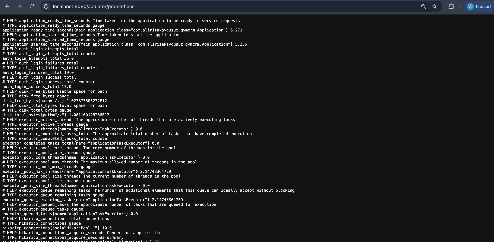

**Custom Metrics:**
```prometheus
# Login metrics
auth_login_attempts_total 36.0
auth_login_success_total 17.0
auth_login_failures_total 19.0

# Registration metrics
user_registration_attempts_total{type="trainee"} 36.0
user_registration_success_total{type="trainee"} 21.0
user_registration_success_total{type="trainer"} 15.0
```

---

## **How to Test**

### **Test Users (Pre-loaded)**

| Username      | Password     | Role    |
|---------------|--------------|---------|
| john.doe      | password123  | Trainee |
| trainer.jane  | password123  | Trainer |

---

### **Testing with Swagger UI**

#### **1. Open Swagger UI**
Navigate to: http://localhost:8080/swagger-ui/index.html

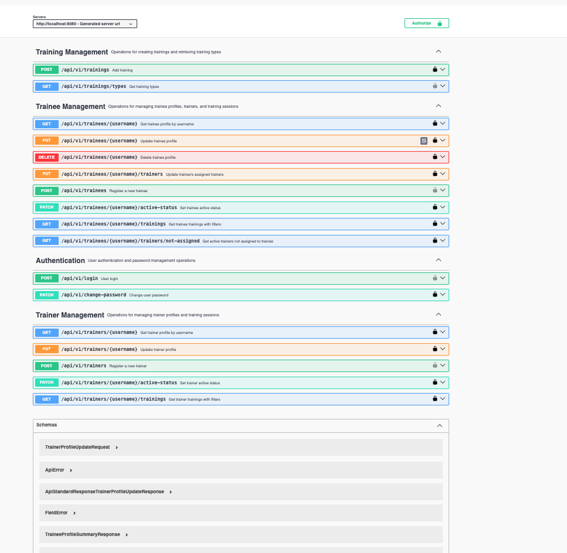

---

#### **2. Login to Get JWT Token**
```http
POST /api/v1/login
Content-Type: application/json

{
  "username": "john.doe",
  "password": "password123"
}
```

**Response:**
```json
{
  "data": {
    "accessToken": "eyJhbGciOiJIUzI1NiIsInR5cCI6IkpXVCJ9...",
    "tokenType": "Bearer",
    "expiresIn": 3600000
  }
}
```

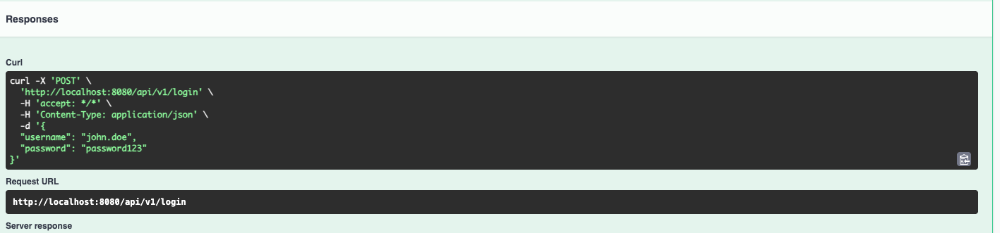

---

#### **3. Authorize with JWT Token**
1. Click **"Authorize"** button (top right, lock icon)
2. Enter: `Bearer <your-token-here>`
3. Click **"Authorize"**
4. Click **"Close"**

All subsequent requests will include the token automatically.

---

#### **4. Test Logout**
```http
POST /api/v1/logout
Authorization: Bearer <token>
→ 200 OK (token blacklisted)
```

Subsequent requests with the same token will return **401 Unauthorized**.

---

#### **5. Test Examples**

**Example 1: Get Trainee Profile (requires auth)**
```http
GET /api/v1/trainees/john.doe
Authorization: Bearer <token>
→ 200 OK
```

**Example 2: Register New Trainee (public - no auth)**
```http
POST /api/v1/trainees
Content-Type: application/json

{
  "firstName": "John",
  "lastName": "Doe",
  "dateOfBirth": "1990-01-01",
  "address": "123 Main St"
}

→ 200 OK
Response: {
  "data": {
    "username": "John.Doe",
    "password": "generatedPassword123"
  }
}
```

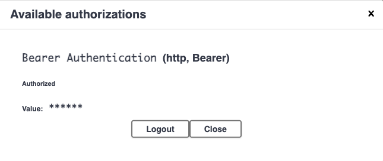

**Database After Registration:**

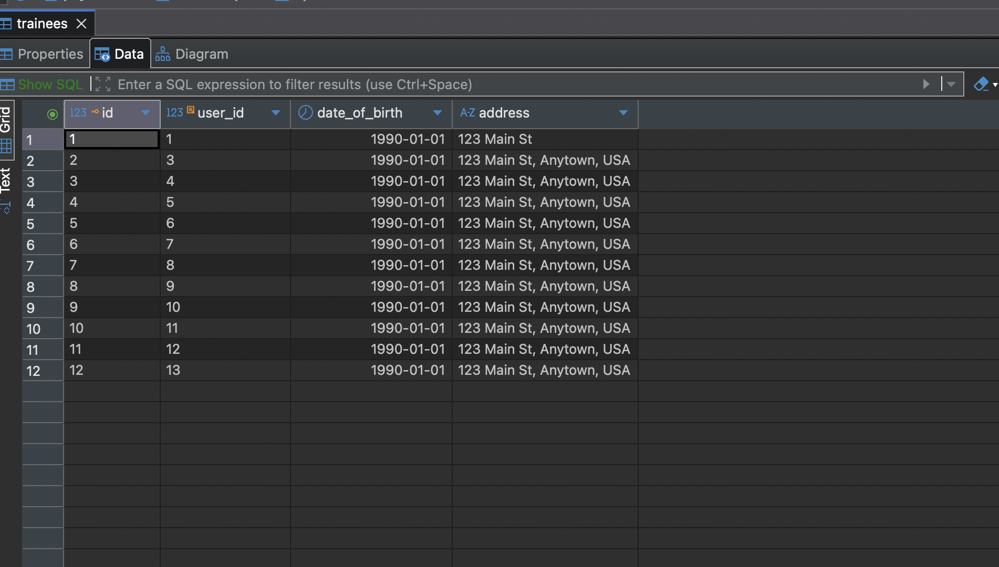
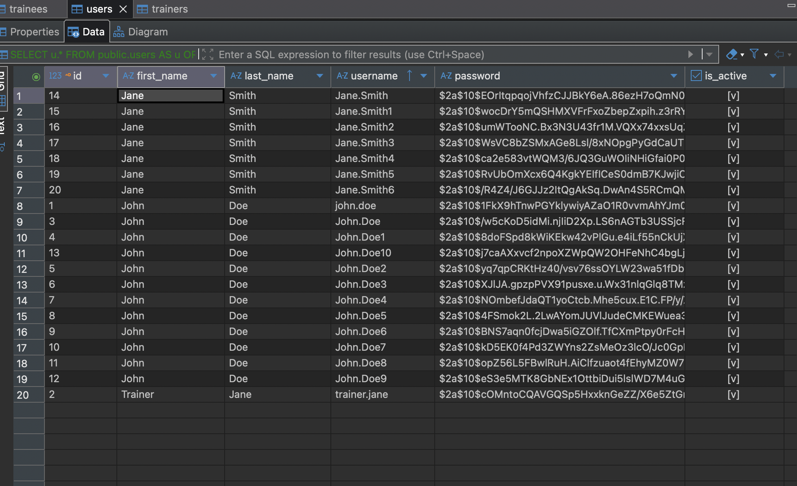

---

## **Security Features in Detail**

### **Login Rate Limiting**

**Configuration (`application.yml`):**
```yaml
security:
  rate-limit:
    login:
      max-attempts: 3
      block-duration: 5m
      redis-key-prefix: "rate-limit:login:"
```

**Behavior:**
- 3 failed login attempts → Account locked for 5 minutes
- Redis tracks attempts per username
- Automatic counter reset on successful login


**Redis Keys:**
```
rate-limit:login:john.doe → "3" (TTL: 300s)
```

---

### **JWT Token Blacklist**

**Configuration (`application.yml`):**
```yaml
security:
  token-blacklist:
    enabled: true
    redis-key-prefix: "token:blacklist:"
```

**Behavior:**
- Logout adds token to Redis blacklist
- TTL = token's remaining expiration time
- Blacklisted tokens rejected with 401 Unauthorized
- Token auto-expires from blacklist when original expiration reached


**Redis Keys:**
```
token:blacklist:eyJhbGc... → "BLACKLISTED" (TTL: remaining token lifetime)
```


---

## **Self-Service Access Control**

### **What It Means**
Each user can only access their own resources. This is enforced via Spring Security `@PreAuthorize` annotations.

### **Implementation Details**

**Composed Annotations:**
- `@SelfTraineeService`: TRAINEE role + username validation
- `@SelfTrainerService`: TRAINER role + username validation
- `AccessPolicy` bean: Reusable `isSelf()` authorization method

**Authorization Flow:**
```
1. User authenticates → JWT filter extracts username and roles
2. User requests GET /api/v1/trainees/john.doe
3. @SelfTraineeService checks:
   - hasRole('TRAINEE')?
   - @accessPolicy.isSelf(authentication, #username)?
4. Match? → Allow (200 OK) | Mismatch? → Throw 403 Forbidden
```

**Code Location:**
- `com.alirizakaygusuz.gymcrm.security.authorization.self.*` - Composed annotations
- `com.alirizakaygusuz.gymcrm.security.authorization.policy.AccessPolicy` - Authorization logic

---

✅ **Public Endpoints (No Authorization Required):**
- `POST /api/v1/login`
- `POST /api/v1/trainees` (registration)
- `POST /api/v1/trainers` (registration)
- `GET /api/v1/trainings/types`
- `GET /actuator/**`

---

## **Enhanced Error Responses**

All error responses include structured metadata for better traceability:

**Fields:**
- **URN:** Unique resource identifier for the error type
- **Request ID:** Correlation ID for tracking across logs
- **Timestamp:** ISO-8601 formatted error occurrence time
- **Code:** Error code (e.g., RATE_LIMIT_EXCEEDED, AUTHORIZATION_FAILED)
- **Message:** Human-readable error description

**Example:**
```json
{
  "error": {
    "requestId": "cdff1859-3a0b-4aef-8a5c-bf26a696add6",
    "urn": "urn:com.alirizakaygusuz.gymcrm:api:POST:v1:login",
    "timestamp": "2026-02-25T11:21:09.679505011Z",
    "code": "RATE_LIMIT_EXCEEDED",
    "message": "Too many login attempts for user 'john.doe'. Account temporarily locked. Try again in 294 seconds.",
    "fieldErrors": null
  }
}
```

---

## **Test Coverage**

Unit tests cover:
- **Service layer:** 91% method coverage
- **Utility classes:** 100% coverage

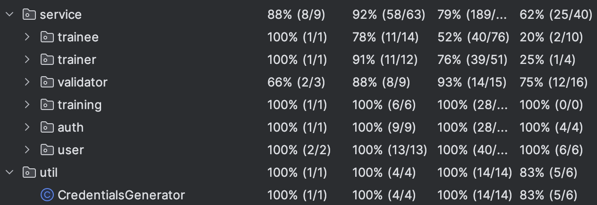

### **Running Tests**
```bash
mvn test
```

---

## **Database**

### **Schema Management**
- **Flyway migrations** handle schema versioning
- Migrations located in `src/main/resources/db/migration`
- Automatic migration on application startup

### **Seed Data**
Pre-loaded test users with BCrypt-hashed passwords:


**Training Types (11 pre-loaded):**
- CARDIO, STRENGTH, FLEXIBILITY, BALANCE, YOGA, PILATES, CROSSFIT, FUNCTIONAL_TRAINING, HIIT, MOBILITY, ENDURANCE

**Username Generation:**
- Format: `FirstName.LastName`
- Auto-increments on duplicates: `John.Doe`, `John.Doe1`, `John.Doe2`

---

## **API Documentation**

Full API documentation is available at:
- **Swagger UI:** http://localhost:8080/swagger-ui/index.html
- **OpenAPI JSON:** http://localhost:8080/v3/api-docs

**Features:**
- All endpoints with request/response schemas
- JWT Bearer token authentication configured
- Example payloads matching seed data
- Try-it-out functionality with live API calls

---