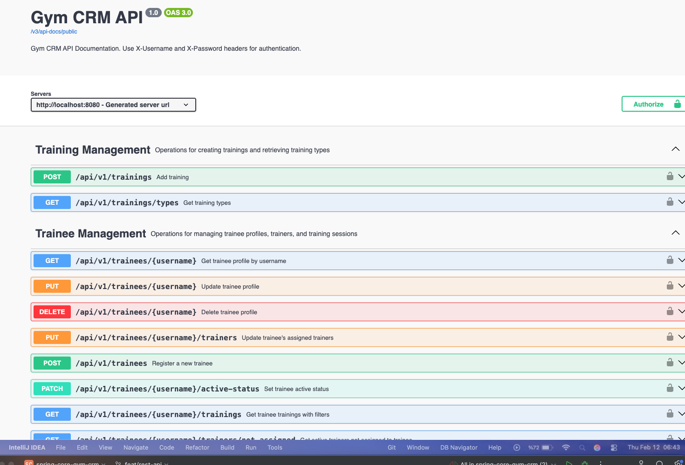
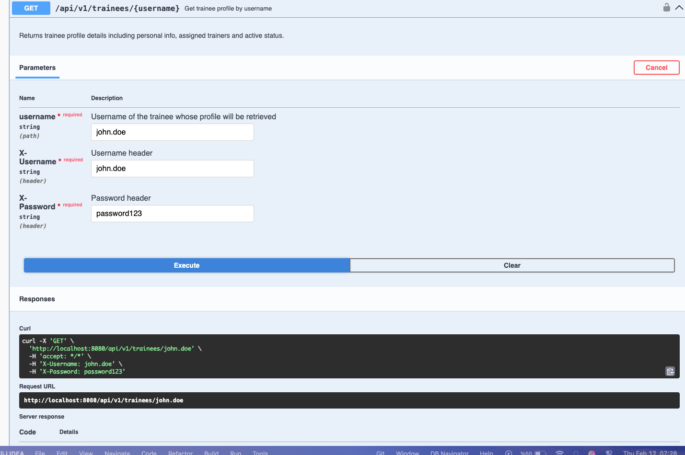
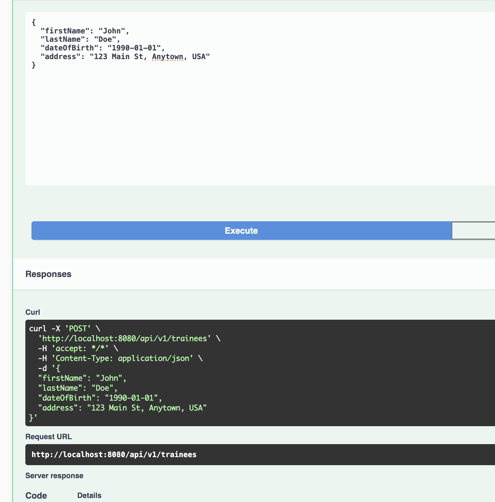
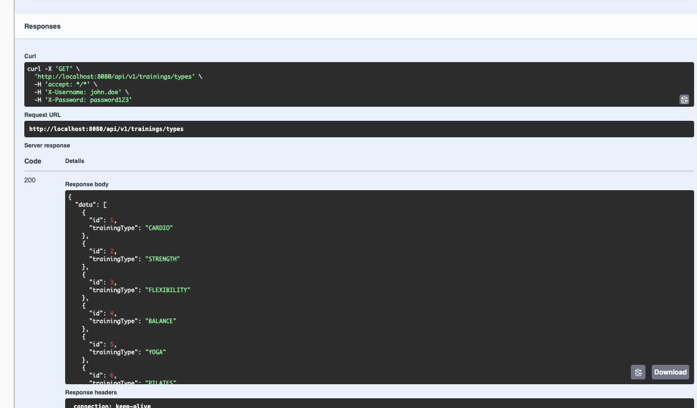
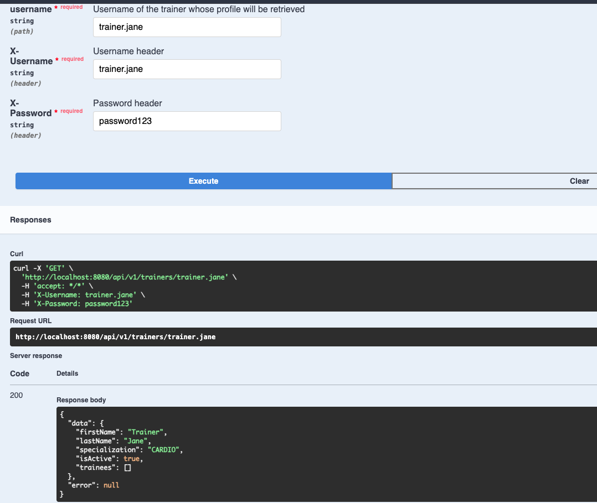
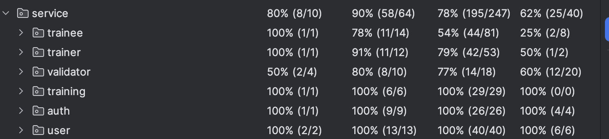

# GymCRM - REST API

A gym customer relationship management system with REST API.

---

## Key Features

### Authentication & Authorization
- Custom header-based authentication (`X-Username`, `X-Password`)
- **Self-access enforcement:** Users can only access their own resources
  - Trainee `john.doe` can only view/update their own profile
  - Trainer `trainer.jane` can only view/update their own profile
- BCrypt password encryption
- Public endpoints: trainee/trainer registration, login

### API Endpoints
- **Authentication:** Login, change password
- **Trainee Management:** Register, get profile, update, delete, activate/deactivate
- **Trainer Management:** Register, get profile, update, activate/deactivate
- **Training Management:** Add training (trainer only), get training types
- **Relationships:** Assign/update trainee's trainers, get unassigned trainers

### Important Rules
- **Only trainers can create trainings** - Trainees cannot add training sessions
- Training creation requires trainer authentication (`X-Username` must be a trainer)

---

## Running the Application

### Prerequisites
- Java 17+
- Maven 3.8+
- Docker & Docker Compose

### Step 1: Build
```bash
mvn clean package -Dmaven.test.skip=true
```

### Step 2: Start Containers
```bash
docker-compose up -d --build
```

### Step 3: Check Logs
```bash
docker logs -f ali-gymcrm-tomcat
```

Wait for: `Server startup in [XXXX] milliseconds`

### Step 4: Access API Documentation
**Swagger UI:** http://localhost:8080/swagger-ui/index.html

---

## How to Test

### Test Users (Pre-loaded)

| Username      | Password     | Role    |
|---------------|--------------|---------|
| john.doe      | password123  | Trainee |
| trainer.jane  | password123  | Trainer |

### Testing with Swagger UI

#### 1. Open Swagger UI
Navigate to: http://localhost:8080/swagger-ui/index.html



#### 2. Authorize
- Click **"Authorize"** button (top right)
- Enter credentials:
  - **X-Username:** `john.doe`
  - **X-Password:** `password123`
- Click **"Authorize"** for both fields
- Click **"Close"**

#### 3. Test Examples

**Example 1: Get Trainee Profile (requires auth)**
```
GET /api/v1/trainees/john.doe
→ 200 OK
```



**Example 2: Register New Trainee (public - no auth)**
```
POST /api/v1/trainees
Body: {
  "firstName": "John",
  "lastName": "Doe",
  "dateOfBirth": "1990-01-01",
  "address": "123 Main St"
}
→ 200 OK (returns username & password)
```



**Example 3: Get Training Types (public - no auth)**
```
GET /api/v1/trainings/types
→ 200 OK (CARDIO, STRENGTH, FLEXIBILITY, etc.)
```



**Example 4: Get Trainer Profile (requires auth)**
```
Authorize with: trainer.jane / password123
GET /api/v1/trainers/trainer.jane
→ 200 OK
```



**Example 5: Update Trainee Profile**
```
Authorize with: john.doe / password123
PUT /api/v1/trainees/john.doe
Body: {
  "firstName": "John",
  "lastName": "Doe",
  "dateOfBirth": "1990-01-01",
  "address": "New Address 456",
  "isActive": true
}
→ 200 OK
```

**Example 6: Change Password**
```
Authorize with: john.doe / password123
PATCH /api/v1/change-password
Body: {
  "username": "john.doe",
  "oldPassword": "password123",
  "newPassword": "newPassword456"
}
→ 200 OK
```

**Example 7: Add Training**
```
Authorize with: trainer.jane / password123
POST /api/v1/trainings
Body: {
  "traineeUsername": "john.doe",
  "trainerUsername": "trainer.jane",
  "trainingName": "Morning Cardio",
  "trainingDate": "2024-06-15",
  "trainingDuration": 60
}
→ 200 OK
```

---

## Self-Access Enforcement

**What it means:**
- Each user can only access their own resources
- Attempting to access another user's profile returns `403 Forbidden`

**Examples:**

✅ **Allowed:**
```bash
# john.doe accessing own profile
X-Username: john.doe
X-Password: password123
GET /api/v1/trainees/john.doe
→ 200 OK
```

❌ **Forbidden:**
```bash
# john.doe trying to access trainer.jane's profile
X-Username: john.doe
X-Password: password123
GET /api/v1/trainers/trainer.jane
→ 403 Forbidden (Access Denied)
```

---

## Test Coverage

Unit tests cover:
- **Service layer:** 90% coverage
- **Utility classes:** 100% coverage
- **Validators:** Full coverage



### Running Tests
```bash
mvn test
```

---

## API Documentation

Full API documentation is available at:
- **Swagger UI:** http://localhost:8080/swagger-ui/index.html
- **OpenAPI JSON:** http://localhost:8080/v3/api-docs

All endpoints, request/response schemas, and authentication requirements are documented there.

**Note:** This project uses **Springdoc OpenAPI 3** instead of Swagger 2 due to compatibility issues with Jakarta EE 10 (Tomcat 10.1). Swagger 2 dependencies caused conflicts with the `jakarta.servlet` namespace.